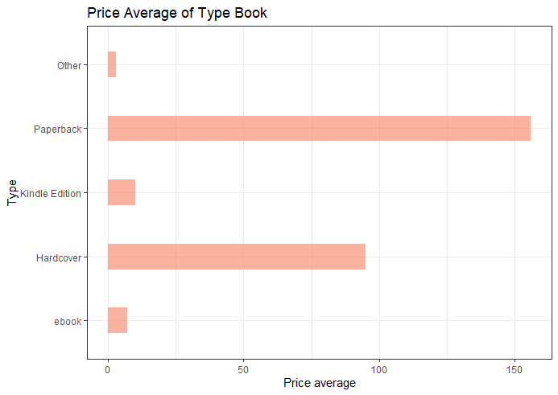
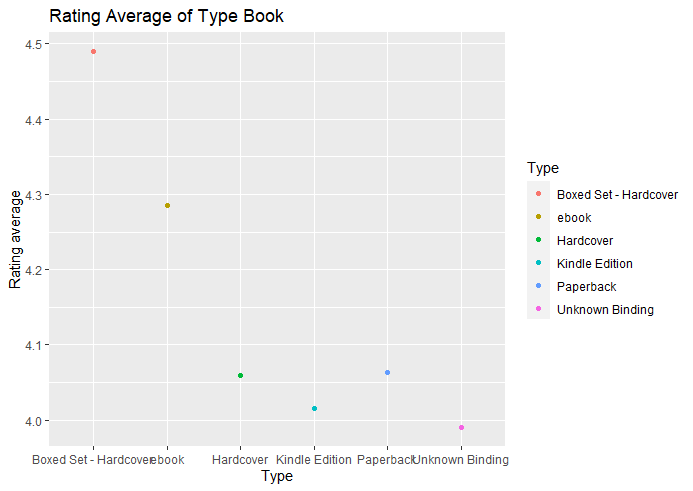

# R-Assignment 4

**Created by Run Lertjitthamrong (ID: 63130500101)**

Choose Dataset:
1. Top 270 Computer Science / Programing Books (Data from Thomas Konstantin, [Kaggle](https://www.kaggle.com/thomaskonstantin/top-270-rated-computer-science-programing-books)) >> [Using CSV](https://raw.githubusercontent.com/safesit23/INT214-Statistics/main/datasets/prog_book.csv)

### Outlines
1. Explore the dataset
2. Learning function from Tidyverse
3. Transform data with dplyr and finding insight the data
4. Visualization with GGplot2

## Part 1: Explore the dataset

```
# Library
library(dplyr)
library(readr)
library(ggplot2)
library(forcats)

# Dataset
books <- read_csv("https://raw.githubusercontent.com/safesit23/INT214-Statistics/main/datasets/prog_book.csv")
```

This dataset holds a list of 270 books in the field of computer science and programming related topics.
The list of books was constructed using many popular websites which provide information on book ratings an of all the book in those websites the 270 
most popular were selected.

### Explore Data
```
View(books)
glimpse(books)
```
According to Programing Books, there are 271 rows and 7 columns.
```
> glimpse(books)
Rows: 271
Columns: 7
$ Rating          <dbl> 4.17, 4.01, 3.33, 3.97, 4.06, 3.84, 4.09, 4.15, 3.87, 4~
$ Reviews         <dbl> 3829, 1406, 0, 1658, 1325, 117, 5938, 1817, 2093, 0, 16~
$ Book_title      <chr> "The Elements of Style", "The Information: A History, a~
$ Description     <chr> "This style manual offers practical advice on improving~
$ Number_Of_Pages <dbl> 105, 527, 50, 393, 305, 288, 256, 368, 259, 128, 352, 3~
$ Type            <chr> "Hardcover", "Hardcover", "Kindle Edition", "Hardcover"~
$ Price           <dbl> 9.323529, 11.000000, 11.267647, 12.873529, 13.164706, 1~
```

## Part 2: Learning function from Tidyverse

- Function `fct_lump()` from package [forcats](https://forcats.tidyverse.org/articles/forcats.html)). It using for collapsing the least/most frequent values of a factor into “other”.
- Function `fct_infreq()` from package [forcats](https://forcats.tidyverse.org/articles/forcats.html)). It using for reordering a factor by the frequency of values.

```
books %>% mutate(Type = fct_lump(Type,n=4))
ggplot(aes(x = fct_infreq(Type),y = n)) + geom_bar(stat="identity")
```
** You can sepearate this part or combine in part of `Transform data with dplyr and finding insight the data`

## Part 3: Transform data with dplyr and finding insight the data
1. Find out how many books in each type of this dataset are there.
ใช้คำสั่ง `mutate()` ในการสร้าง Column เพิ่ม จากนั้นใช้คำสั่ง `fct_lump` ในการแสดงข้อมูลเพียงแค่ 4 กลุ่มแรก ถ้ามีข้อมูลอื่นอีกจะขึ้นเป็น Other ใช้คำสั่ง `count()` ในการนับจำนวนข้อมูลของแต่ละกลุ่ม และเรียงลำดับข้อมูลให้แสดงจากมากไปน้อย 
```
books %>% mutate(Type = fct_lump(Type,n=4)) %>% count(Type,sort = T)
```

Result:

```
  Type               n
  <fct>          <int>
1 Paperback        156
2 Hardcover         95
3 Kindle Edition    10
4 ebook              7
5 Other              3
```


2. What is the average rating of each book type?
ใช้คำสั่ง `mutate()` ในการสร้าง Column เพิ่ม จากนั้นใช้คำสั่ง `fct_lump` ในการแสดงข้อมูลเพียงแค่ 5 กลุ่มแรก ถ้ามีข้อมูลอื่นอีกจะขึ้นเป็น Other ใช้คำสั่ง `group_by()` ในการจัดกลุ่มของข้อมูลแต่ละประเภท 
ใช้คำสั่ง `summarise()` เพื่อหาค่าเฉลี่ยของ Rating โดยให้มองข้ามข้อมูลที่มีค่าเป็น NA
```
books %>% mutate(Type = fct_lump(Type,n=5)) %>%  group_by(Type) %>%
  summarise(mean = mean(Rating, na.rm = TRUE))
```

Result:

```
  Type                   mean
  <fct>                 <dbl>
1 Boxed Set - Hardcover  4.49
2 ebook                  4.29
3 Hardcover              4.06
4 Kindle Edition         4.01
5 Paperback              4.06
6 Unknown Binding        3.99
```


3. What is the average price of each type of book?
ใช้คำสั่ง `mutate()` ในการสร้าง Column เพิ่ม จากนั้นใช้คำสั่ง `fct_lump` ในการแสดงข้อมูลเพียงแค่ 5 กลุ่มแรก ถ้ามีข้อมูลอื่นอีกจะขึ้นเป็น Other ใช้คำสั่ง `group_by()` ในการจัดกลุ่มของข้อมูลแต่ละประเภท 
ใช้คำสั่ง `summarise()` เพื่อหาค่าเฉลี่ยของ Price โดยให้มองข้ามข้อมูลที่มีค่าเป็น NA
```
books %>% mutate(Type = fct_lump(Type,n=6)) %>%  group_by(Type) %>%
  summarise(mean = mean(Price, na.rm = TRUE))
```

Result:

```
  Type                   mean
  <fct>                 <dbl>
1 Boxed Set - Hardcover 220. 
2 ebook                  51.4
3 Hardcover              70.1
4 Kindle Edition         32.4
5 Paperback              45.8
6 Unknown Binding        37.2
```

4. Find out which books have ratings more than 4.50.
ใช้คำสั่ง `select` เพื่อเลือกให้แสดงแค่ Columns ของ Book_title, Number_Of_Pages, Price และ Rating จากนั้นใช้คำสั่ง `filter()` เพื่อหาข้อมูลเฉพาะที่มี Rating มากกว่า 4.50 คะแนน
```
books %>% select(Book_title,Number_Of_Pages,Price,Rating) %>% filter(Rating > 4.50)
```

Result:

```
Book_title                                       Number_Of_Pages Price Rating
   <chr>                                                      <dbl> <dbl>  <dbl>
 1 ZX Spectrum Games Code Club: Twenty fun games t~             128  14.6   4.62
 2 Your First App: Node.js                                      317  25.9   5   
 3 The Elements of Computing Systems: Building a M~             325  41.3   4.54
 4 Build Web Applications with Java: Learn every a~             372  42.3   4.67
 5 Designing Data-Intensive Applications: The Big ~             616  45.6   4.72
 6 The Linux Programming Interface: A Linux and Un~            1506  46.4   4.62
 7 Practical Object Oriented Design in Ruby                     247  50.1   4.54
 8 Fluent Python: Clear, Concise, and Effective Pr~             792  64.1   4.67
 9 CLR via C# (Developer Reference)                             863  66.3   4.58
10 The Art of Computer Programming, Volumes 1-4a B~            3168 220.    4.77
```


5. Find out how many books are rating less than the average of each type book.
ใช้ `filter()` ในการกรองข้อมูลที่มี Rating น้อยกว่าค่าเฉลี่ย จากนั้นใช้คำสั่ง `group_by()` เพื่อจัดข้อมูลของแต่ละประเภท และใช้คำสั่ง `count()` เพื่อนับจำนวนข้อมูลที่มีค่า Rating น้อยกว่าค่าเฉลี่ย 
```
books %>% filter(Rating < mean(Rating, na.rm = TRUE)) %>% group_by(Type) %>% count()
```

Result:

```
  Type                n
  <chr>           <int>
1 ebook               2
2 Hardcover          49
3 Kindle Edition      6
4 Paperback          66
5 Unknown Binding     1
```


6. How many books have less than 200 reviews and a rating of more than 4.00 by grouping by book type.
ใช้ `filter()` ในการกรองข้อมูลที่มีคน Review น้อยกว่า 200 และมีคะแนน Rating มากกว่า 4.00 จากนั้นใช้คำสั่ง `group_by()` เพื่อจัดข้อมูลของแต่ละประเภท และใช้คำสั่ง `count()` เพื่อนับจำนวนข้อมูล
```
books %>% filter(Reviews < 200 & Rating > 4.00 ) %>% group_by(Type) %>% count()
```

Result:

```
  Type                      n
  <chr>                 <int>
1 Boxed Set - Hardcover     1
2 ebook                     6
3 Hardcover                48
4 Kindle Edition            5
5 Paperback                79
6 Unknown Binding           1
```


## Part 4: Visualization with GGplot2
### 1.) The bar chart represents the number of books of each type.
```
book_price_plot <- books %>% mutate(Type = fct_lump(Type,n=4)) %>% count(Type,sort = T)

#GGplot2
book_price_plot <- book_price_plot %>% ggplot(aes(x = fct_infreq(Type),y = n)) + geom_bar(stat="identity", fill="#f68060", alpha=.6, width=.4) +
  coord_flip() + theme_bw()

book_price_plot + ggtitle("Price Average of Type Book") + xlab("Type") + ylab("Price average")
```
Result:




### 2.) The chart shows the ratings of each book type.
```
book_rt_plot <- books %>% mutate(Type = fct_lump(Type,n=5)) %>%  group_by(Type) %>%
  summarise(mean = mean(Rating, na.rm = TRUE))
#GGplot2
book_rt_plot <- book_rt_plot %>% ggplot(aes(x = Type,y = mean)) + geom_point(aes(color=Type)) 

book_rt_plot + ggtitle("Rating Average of Type Book") +
  xlab("Type") + ylab("Rating average")
```
Result:


