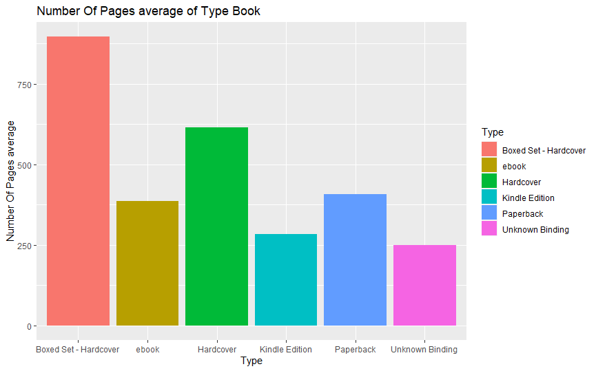
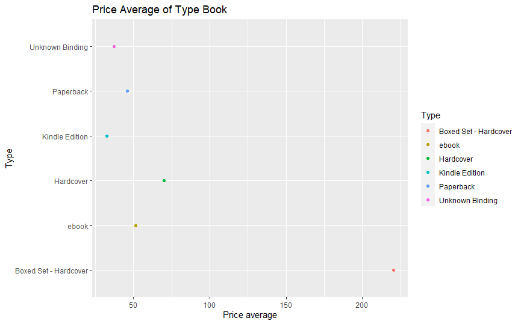

# R-Assignment 4

**Created by Wasin Sukeesup (ID: 63130500104)**

Choose Dataset:
1. Top 270 Computer Science / Programing Books (Data from Thomas Konstantin, [Kaggle](https://www.kaggle.com/thomaskonstantin/top-270-rated-computer-science-programing-books)) >> [Using CSV](https://raw.githubusercontent.com/safesit23/INT214-Statistics/main/datasets/prog_book.csv)

### Outlines
1. Explore the dataset
2. Learning function from Tidyverse
3. Transform data with dplyr and finding insight the data
4. Visualization with GGplot2

## Part 1: Explore the dataset

```
# Library
library(dplyr)
library(readr)
library("ggplot2")
library(forcats)

#Load data
books <- read_csv("https://raw.githubusercontent.com/safesit23/INT214-Statistics/main/datasets/prog_book.csv")
view(books)
```


This dataset is all about books with ratings, review scores, prices, and details about each book.


## Part 2: Learning function from Tidyverse

- Function `fct_lump()` from package [forcats](https://forcats.tidyverse.org/articles/forcats.html)). used to set the number of rows want to show.

```
books %>% mutate(Type = fct_lump(Type,n=3)) %>% count(Type, sort = TRUE)
```
** You can sepearate this part or combine in part of `Transform data with dplyr and finding insight the data`

## Part 3: Transform data with dplyr and finding insight the data

1 What is the average review of each book type?
```
books %>% mutate(Type = fct_lump(Type,n=5)) %>%  group_by(Type) %>%
  summarise(mean = mean(Reviews, na.rm = TRUE))
```

Result:

```
  Type                   mean
  <fct>                 <dbl>
1 Boxed Set - Hardcover  36  
2 ebook                  51.4
3 Hardcover             315. 
4 Kindle Edition        156. 
5 Paperback             116. 
6 Unknown Binding       124. 
```
Explain
- Find the average of reviews by book type.

2 What is the average price of each book type?

```
books %>% mutate(Type = fct_lump(Type,n=5)) %>%  group_by(Type) %>%
  summarise(Price = mean(Price, na.rm = TRUE))
```

Result:

```
    Type                  Price
  <fct>                 <dbl>
1 Boxed Set - Hardcover 220. 
2 ebook                  51.4
3 Hardcover              70.1
4 Kindle Edition         32.4
5 Paperback              45.8
6 Unknown Binding        37.2
```
Explain
- Find the average of price by book type.

3 What is the average rating of each book type?

```
books %>% mutate(Type = fct_lump(Type,n=5)) %>%  group_by(Type) %>%
  summarise(Rate = mean(Rating, na.rm = TRUE))
```

Result:

```
  Type                   Rate
  <fct>                 <dbl>
1 Boxed Set - Hardcover  4.49
2 ebook                  4.29
3 Hardcover              4.06
4 Kindle Edition         4.01
5 Paperback              4.06
6 Unknown Binding        3.99

```
Explain
- Find the average of rating by book type.

4 Find hardcover books that cost over $100. grouped by book type

```
books %>% filter(Type == 'Hardcover' & Price > 100) %>% group_by(Type)
```

Result:

```
   Rating Reviews Book_title                            Description                           Number_Of_Pages Type  Price
    <dbl>   <dbl> <chr>                                 <chr>                                           <dbl> <chr> <dbl>
 1   4.42      38 Computer Systems: A Programmer's Per~ "For Computer Organization and Archi~             978 Hard~  103.
 2   4.11      56 Modern Operating Systems              "For software development profession~             976 Hard~  103.
 3   3.96      15 Structured Computer Organization      "Completely updated, this book expla~             669 Hard~  104.
 4   3.67       2 Game Engine Gems 1                    "Game Engine Gems Brings Together In~             362 Hard~  106.
 5   4.13      14 Concepts, Techniques, and Models of ~ "This innovative text presents compu~             936 Hard~  108.
 6   4.16      16 The C++ Standard Library: A Tutorial~ "The Best-Selling C++ ResourceNow Up~            1136 Hard~  113.
 7   4.18     130 Artificial Intelligence: A Modern Ap~ "For one or two-semester, undergradu~            1132 Hard~  116.
 8   3.45       1 3D Game Engine Design: A Practical A~ "A major revision of the internation~            1040 Hard~  118.
 9   3.82       0 Game Programming Gems 6               "Welcome to the sixth volume of the ~             700 Hard~  119.
10   4.08      56 Compilers: Principles, Techniques, a~ "This introduction to compilers is t~             796 Hard~  127.
11   3.77       0 Game Programming Gems 4               "Uncover the secrets of the game ind~             703 Hard~  139.
12   3.82       0 Game Programming Gems 3               "The journey continues with this ALL~             663 Hard~  143.
13   4.26       5 Numerical Recipes: The Art of Scient~ "Co-authored by four leading scienti~            1235 Hard~  176.
14   3.76       0 3D Game Engine Architecture: Enginee~ "Dave Eberly's 3D Game Engine Design~             752 Hard~  203.
15   4.77       4 The Art of Computer Programming, Vol~ "\"The bible of all fundamental algo~            3168 Hard~  220.
16   3.84       5 A Discipline for Software Engineering "Designed to help individual program~             789 Hard~  236.
```
Explain
- Shows hardcover books priced over 100. and grouped by book type

5 Find the average number of pages for each type of book.
```
books %>% mutate(Type = fct_lump(Type,n=5)) %>%  group_by(Type) %>%
  summarise(Number_Of_Pages = mean(Number_Of_Pages, na.rm = TRUE))
```

Result:

```
    Type                  Number_Of_Pages
  <fct>                           <dbl>
1 Boxed Set - Hardcover            896 
2 ebook                            386 
3 Hardcover                        614.
4 Kindle Edition                   283.
5 Paperback                        407.
6 Unknown Binding                  249 
```
Explain
- Show the average number of pages for each type of book.

6 Find Book title,Price,Reviews,Rating with higher than average reviews

```
books %>% select(Book_title,Price,Reviews,Rating) %>% filter(Reviews > mean(Reviews, na.rm = TRUE))
```

Result:

```
    Book_title                                                                                  Price Reviews Rating
   <chr>                                                                                       <dbl>   <dbl>  <dbl>
 1 The Elements of Style                                                                        9.32    3829   4.17
 2 The Information: A History, a Theory, a Flood                                               11       1406   4.01
 3 Ghost in the Wires: My Adventures as the World's Most Wanted Hacker                         12.9     1658   3.97
 4 How Google Works                                                                            13.2     1325   4.06
 5 Start with Why: How Great Leaders Inspire Everyone to Take Action                           14.2     5938   4.09
 6 Algorithms to Live By: The Computer Science of Human Decisions                              14.4     1817   4.15
 7 Weapons of Math Destruction: How Big Data Increases Inequality and Threatens Democracy      14.5     2093   3.87
 8 The Master Algorithm: How the Quest for the Ultimate Learning Machine Will Remake Our World 15.2      481   3.78
 9 Superintelligence: Paths, Dangers, Strategies                                               15.7     1255   3.87
10 The Art of the Start: The Time-Tested, Battle-Hardened Guide for Anyone Starting Anything   15.9      593   3.87
# ... with 36 more rows
```
Explain
- Show Book title,Price,Reviews,Rating with higher than average reviews

## Part 4: Visualization with GGplot2
### 1.) The bar chart represents the Number Of Pages average of Type Book.
```
Page_plot <- books %>% mutate(Type = fct_lump(Type,n=5)) %>%  group_by(Type) %>%
  summarise(Number_Of_Pages = mean(Number_Of_Pages, na.rm = TRUE))

Page_plot <- Page_plot %>% ggplot(aes(x = fct_infreq(Type),y = Number_Of_Pages,fill=Type)) + geom_bar(stat="identity") 

Page_plot + ggtitle("Number Of Pages average of Type Book") + xlab("Type") + ylab("Number Of Pages average")
```
Result:




### 2.) Book price charts go up and down about ratings and reviews.

```
bookPrice_plot <- books %>% select(Book_title,Price,Reviews,Rating) %>% filter(Reviews > mean(Reviews, na.rm = TRUE))

bookPrice_plot <- bookPrice_plot %>% ggplot(aes(x = Rating,y = Reviews,color=Price)) + geom_line() + geom_point()

bookPrice_plot + ggtitle("Book price charts go up and down about ratings and reviews.") +
  xlab("Rating") + ylab("Reviews")
```
Result:


