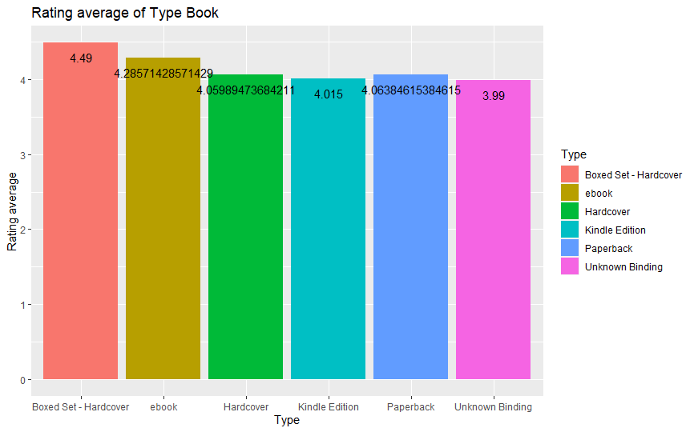
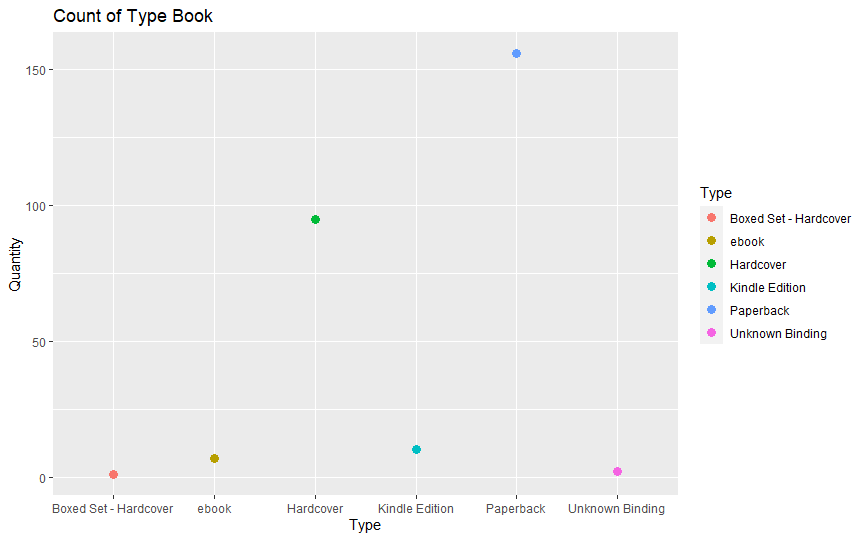

# R-Assignment 4

**Created by Rungphob Jaraspat (ID: 63130500157)**

Choose Dataset:
1. Top 270 Computer Science / Programing Books (Data from Thomas Konstantin, [Kaggle](https://www.kaggle.com/thomaskonstantin/top-270-rated-computer-science-programing-books)) >> [Using CSV](https://raw.githubusercontent.com/safesit23/INT214-Statistics/main/datasets/prog_book.csv)

### Outlines
1. Explore the dataset
2. Learning function from Tidyverse
3. Transform data with dplyr and finding insight the data
4. Visualization with GGplot2

## Part 1: Explore the dataset

```
# Library
library(dplyr)
library(readr)
library("ggplot2")
library(forcats)

#Load data
books <- read_csv("https://raw.githubusercontent.com/safesit23/INT214-Statistics/main/datasets/prog_book.csv")
view(books)
```


This dataset holds a list of 270 books in the field of computer science and programming related topics.
The list of books was constructed using many popular websites which provide information on book ratings an of all the book in those websites the 270 most popular were selected.


## Part 2: Learning function from Tidyverse

- Function `fct_lump()` from package [forcats](https://forcats.tidyverse.org/articles/forcats.html)). used to set the number of rows want to show.
- 
- Function `fct_infreq()` from package [forcats](https://forcats.tidyverse.org/articles/forcats.html)). It using for reordering a factor by the frequency of values.

```
books %>% mutate(Type = fct_lump(Type,n=3)) %>% count(Type, sort = TRUE)
```
** You can sepearate this part or combine in part of `Transform data with dplyr and finding insight the data`

## Part 3: Transform data with dplyr and finding insight the data

1 Find title of Books with more than 1000 pages
```
books %>% select(Book_title, Number_Of_Pages) %>% filter(Number_Of_Pages > 1000)
```

Result:

```
   Book_title                                                                                             Number_Of_Pages
   <chr>                                                                                                            <dbl>
 1 Beginning Java 2                                                                                                  1200
 2 PHP and MySQL Web Development (Developer's Library)                                                               1008
 3 The Linux Programming Interface: A Linux and Unix System Programming Handbook                                     1506
 4 Learning Python                                                                                                   1214
 5 The C++ Programming Language                                                                                      1040
 6 Database System Concepts                                                                                          1142
 7 Introduction to Algorithms                                                                                        1180
 8 Game Engine Architecture                                                                                          1052
 9 Geometric Tools for Computer Graphics                                                                             1056
10 Modern Operating Systems, 4th Edition                                                                             1136
11 The C++ Standard Library: A Tutorial and Reference                                                                1136
12 Artificial Intelligence: A Modern Approach                                                                        1132
13 3D Game Engine Design: A Practical Approach to Real-Time Computer Graphics (The Morgan Kaufmann Serie~            1040
14 Numerical Recipes: The Art of Scientific Computing                                                                1235
15 An Introduction to Database Systems                                                                               1040
16 The Art of Computer Programming, Volumes 1-4a Boxed Set                                                           3168
```
Explain
- ใช้คำสั่ง `select()` เพื่อหา Book_title และ Number_Of_Pages และ ใช้คำสั่ง `filter()` เพื่อหาหนังสือที่มีจำนวนหน้ามากกว่า 1000 หน้า

2 Find number of book of each type. Please sort data by descending

```
books %>% select(Type) %>% group_by(Type) %>% count(Type,sort=T)
```

Result:

```
    Type                      n
  <chr>                 <int>
1 Paperback               156
2 Hardcover                95
3 Kindle Edition           10
4 ebook                     7
5 Unknown Binding           2
6 Boxed Set - Hardcover     1
```
Explain
- ใช้คำสั่ง `select()` เพื่อหาประเภทหนังสือ และ ใช้คำสั่ง `group by()` เพื่อจัดประเภทข้อมูล และใช้ `count(x,sort=T)` เพื่อนับจำนวนข้อมูล และ sort ข้อมูลภายใน `count()`

3 What is the average price of each book type? and filter price average more than 40$

```
books %>% mutate(Type = fct_lump(Type,n=5)) %>%  group_by(Type) %>%
  summarise(Price_Mean = mean(Price, na.rm = TRUE)) %>% filter(Price_Mean >40)
```

Result:

```
  Type                  Price_Mean
  <fct>                      <dbl>
1 Boxed Set - Hardcover      220. 
2 ebook                       51.4
3 Hardcover                   70.1
4 Paperback                   45.8

```
Explain
- ใช้คำสั่ง `mutate()` ในการสร้าง Column เพิ่ม จากนั้นใช้คำสั่ง `fct_lump` ในการแสดงข้อมูลเพียงแค่ 5 กลุ่มแรก ถ้ามีข้อมูลอื่นอีกจะขึ้นเป็น Other ใช้คำสั่ง `group_by()` ในการจัดกลุ่มของข้อมูลแต่ละประเภท 
ใช้คำสั่ง `summarise()` เพื่อหาค่าเฉลี่ยของ Price โดยให้มองข้ามข้อมูลที่มีค่าเป็น NA และ ใช้ `filter()` เพื่อหาข้อมูลที่มีค่าเฉลี่ยน้อยกว่า 40

4 Find average rating of each book type and filter rating average more than 4.20

```
books %>% mutate(Type = fct_lump(Type,n=5)) %>%  group_by(Type) %>%
  summarise(Rating = mean(Rating, na.rm = TRUE)) %>% filter(Rating > 4.20)
```

Result:

```
   Type                  Rating
  <fct>                  <dbl>
1 Boxed Set - Hardcover   4.49
2 ebook                   4.29
```
Explain
-  ใช้คำสั่ง `mutate()` ในการสร้าง Column เพิ่ม จากนั้นใช้คำสั่ง `fct_lump` ในการแสดงข้อมูลเพียงแค่ 5 กลุ่มแรก ถ้ามีข้อมูลอื่นอีกจะขึ้นเป็น Other ใช้คำสั่ง `group_by()` ในการจัดกลุ่มของข้อมูลแต่ละประเภท 
ใช้คำสั่ง `summarise()` เพื่อหาค่าเฉลี่ยของ Rating โดยให้มองข้ามข้อมูลที่มีค่าเป็น NA และ ใช้ `filter()` เพื่อหาข้อมูลที่มีค่าเฉลี่ยน้อยกว่า 4.20

5 Find the book that has type is Paperback and price is more than 100. 
```
books %>% select(Book_title, Type, Price, Rating) %>% filter(Type == 'Paperback' & Price > 100)
```

Result:

```
    Book_title                                            Type      Price Rating
  <chr>                                                 <chr>     <dbl>  <dbl>
1 Computer Architecture: A Quantitative Approach        Paperback  101.   4.1 
2 Modern Operating Systems, 4th Edition                 Paperback  103.   4.11
3 File Structures: An Object-Oriented Approach with C++ Paperback  108.   3.87
4 An Introduction to Database Systems                   Paperback  212.   3.94
```
Explain
- ใช้คำสั่ง `select()` เพื่อหาข้อมูลต่างๆของ Book และใช้คำสั่ง `filter()` เพื่อหาประเภทข้อมูลที่ชื่อว่า Paperback และมีราคามากกว่า 100$

6 Find the count of book that type and the price of book less than average. Please sort data by descending

```
books %>% filter(Price < mean(Price, na.rm=TRUE)) %>% group_by(Type) %>% count(Type,sort=T)
```

Result:

```
   Type                n
  <chr>           <int>
1 Paperback         116
2 Hardcover          34
3 Kindle Edition     10
4 ebook               4
5 Unknown Binding     2
```
Explain
- ใช้คำสั่ง `filter()` เพื่อหาค่าเฉลี่ยของ Price โดยไม่คิดค่าจากข้อมูล NA และ ใช้คำสั่ง `group by()` เพื่อจำแนกข้อมูลแต่โดยใช้ Type เป็นตัวจำแนก และ ใช้คำสั่ง `count(x,sort=T)` เพื่อหาจำนวนของข้อมูล และเรียงลำดับข้อมูลจากมากกไปน้อย

## Part 4: Visualization with GGplot2
### 1.) The bar chart represents the Rating average of type of books.
```
Rate_plot <- books %>% mutate(Type = fct_lump(Type,n=5)) %>%  group_by(Type) %>%
  summarise(Rating = mean(Rating, na.rm = TRUE))

Rate_plot <- Rate_plot %>% ggplot(aes(x = fct_infreq(Type),y = Rating,fill=Type)) + 
  geom_bar(stat="identity") + geom_text(aes(label=Rating), vjust=2)


Rate_plot + ggtitle("Rating average of Type Book") + xlab("Type") + ylab("Rating average")
```
Result:




### 2.) The Chart Show Count of Type Book

```
count_plot <- books %>% mutate(Type = fct_lump(Type,n=5)) %>% count(Type,sort = T)

count_plot <- count_plot %>% ggplot(aes(x = fct_infreq(Type),y = n)) + 
  geom_line(size = 1) + geom_point(aes(color=Type), size=3) 

count_plot + ggtitle("Count of Type Book") +
  xlab("Type") + ylab("Quantity")
```
Result:



